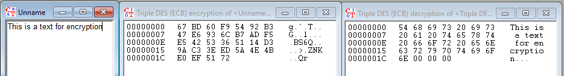
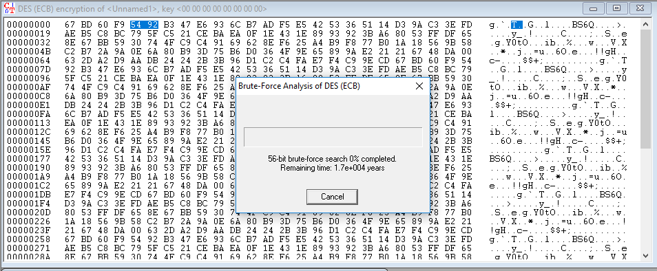
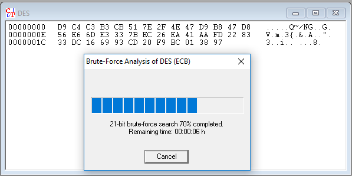
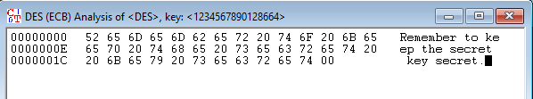
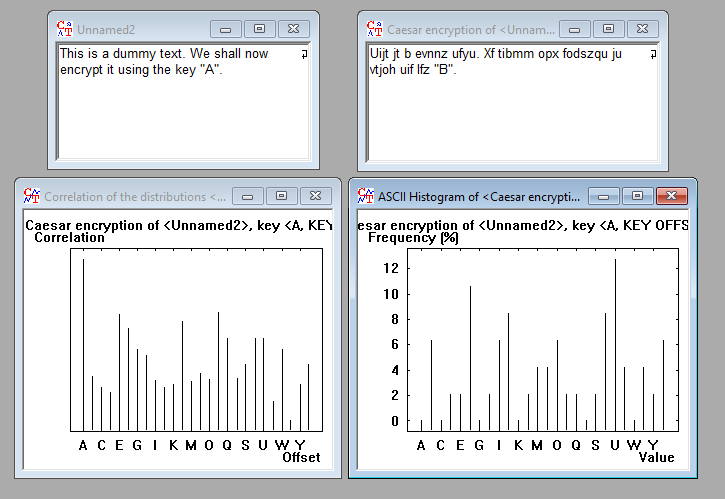

# Netværkssikkerhed

## Generelt

### Eksamen

Eksamen kommer til at tage udgangspunkt i de labs, vi har gennem semesteret. Ingen faste afleveringer, men resultater og diskussioner samt eksterne kilder skal noteres, så der er noter til eksamen. Yderligere pensum bliver diskuteret fra uge 10.

## Lektion 1
#### **Materiale: Kap. 1**

* Passivt angreb
    * Aflytning af data
    * Modtaget data analyse af tredjepart
    * Traffic analysis. Hvem kommunikerer med hvem?

* Aktivt angreb
    * Ændringer i data. Eksempelvis: Afsendt data bliver opsnuset på vejen, ændret af en tredjepart og sendt videre til modtager.
    * **Masquerade**. Forfalskede IP adresser ved IP spoofing, eller foregivea at være en anden person.
    * **Replay**. Opsnusning af data, der gensendes. Eksempelvis en bankoverførsel.
    * **Modification**. Ændring af besked.
    * **Denial of Service**. Nægte brugere adgang til et system el. en service.

* Physical attack
    * Fysisk adgang til hardware. Eksempelvis implementation af fysisk aflytningsenhed, kopi af harddiske mm.

    * Modifikation af devices til Internet of Things. Eksempelvis målingsapparater, der sender automatisk data til systemet.

* Security Services
    
    * **X800**
        * *Authentication*. Verifikation af bruger. Er dataen autentisk? Kommer den hvor vi forventer den kommer fra?
        * *Access Control*. Kun dem, der har lov til at tilgå informationen, kan gøre det. Indebærer naturligvis authentication.
        * *Data Confideniality*. Beskytte mod passive angreb ved fx. at sikre linjen mellem to brugere, eller beskyttelse af en enkelt email mod eaves-dropping. Ydermere mod traffic analysis, så det ikke kan afsløres hvilke parter, der kommunikerer.
        * *Data Integrity*. En strøm af meddelser, en hel forbindelse eller enkelte meddelser, der skal beskyttes mod ændringer undervejs.
        * *Nonrepudiation*. Sikre, at en sender eller modtager ikke kan afvise, at kommunikation er foretaget. Eksempelvis afvisning af en kontrakt, der er sendt og underskrevet. 
        * *Availability*. Data og systemer skal være tilgængelige for dem, der skal bruge dem. Sikre mod denial of service.

        **Se sikkerhedsmekanismerne, der kan bruges til at overholde X800. Table 1.2 (side 9), table 1.3 (side 12) og table 1.4 (side 13) i bogen.**

    
    * Attack Service
        * Bruges til at lave attack-trees. Hvor kan der angribes?
        
        **Se side 15.**


## Lab

### HTTP sniffing 

Når vi forsøger at logge ind via en usikret HTTP forbindelse, kan vi i Wireshark se den ukrypterede data. Herunder ses POST kaldet med en HTML form og den indsendte data. Normalt ville denne data være krypteret. Jeg har brugt hjemmesiden http://vwww.aavtrain.com.


### Attack Tree

* Campusnet Account Compromiser
    * User credential compromise
        * UT/U1a User surveillance
        * UT/U1b Theft of token and handwritten notes
        * Malicious software installation
            * Vulnerability exploit
                * UT/U2a Hidden code
                * UT/U2b Worms
            * UT/U2c E-mails with malicious code
        * CC2 Sniffing
        * User communication with attacker
            * UT/U4a Social engineering
            * Redirection of communication toward fraudulet site
                * CC1 Pharming
            * CNS1 Web site manipulation
    * Injection of commands
        * CC3 Active man-in-the middle attacks
    * User credeential guessing
        * CNS2 Brute force attacks
    * CNS3 Security policy violations
    * Use of known authenticated session by attacker
        * Normal user authentication with specified session ID
            * CC4 Pre-defined session IDs (session hjacking)


## Lektion 2: Cryptography
#### **Materiale: Kap. 2**

#### **Symmetric encryption**

1. **Plaintext** (message / data) is fed to algorithm

2. **Encryption algorithnm** performs transformation / substitution of plaintext

3. The **Secret key** is also input to the algorithm. Exact transformation / substitution depends on the key, and it must be kept secret from intruders at all times.

4. The **Ciphertext** is the scrambled message output. Different keys will produce different results.

5. The **Decryption algorithm** is basically the encryption algorithm in reverse. 

**NOTE:** Symmetric encryption is only viable as long as the secret keys stay secret. Then, even if opponents know the algorithm, they will not be able to decipher the text. Symmetric encryption is widely used, as it is easier to use a good, known encryption algorithm and then store the keys safely, than it is to come up with a new efficient encryption algorithm. As such, companies can easily encrypt products and/or data of products, providing both ends with a secret key.

___

**Cryptography systems are generally classified along three independent dimensions:**

1. The type of operations used for transforming plaintext to ciphertext. 
    - Substitution, in which bits, letters, groups of bits or letters are mapped into another element.
    - Transposition, in which elements in the plaintext are rearranged.
    **Algorithm MUST be reversible, and must be able to restore data without any loss**

2. The number of keys used
    - Sender / receiver use same key: Symmetric, single-key, secret-key or conventional encryption
    - Sender / receiver use different keys: Asymmetric, two-key, public-key encryption.

3. The way in which the plaintext is processed.
    - Block cipher: Processes input one block of elements at a time, producing an output block for each input block.
    - Stream cipher: Processes the input elements continuously, producing output one element at a time, as it goes along.

___

**An encryption scheme is computationally secure if the generated ciphertext meets one or both of the following criteria:**
    - The cost of breaking the cipher exceeds the value of the encrypted information. 
    - The time required to break the cipher exceeds the useful lifetime of the information.

The brute-force approach to revealing the key is indicated when there are no apparent mathematical weaknesses in the algorithm. On average, half of all possible keys must be tried to achieve success. Unless known plaintext is provided (chosen plaintext, like a common header of bank-transfer files from x bank), the analyst must know how to distinguish plaintext from gabble. If the plaintext is in English, distinguishing words from gabble might be easy, however recognizing English words must be automated. It is more difficult if the text has been compressed before encryption or it is data, such as a numerical file.

___

#### **The Feistel Structure**

The Feistel Structure is a particular example of the more general structure used by all symmetric block ciphers.

- **Block size**: Larger block sizes -> greater security. Commonly 128 bits.
- **Key size**: Larkey key sizes -> greater security. Commonly 128 bits.
- **Number of rounds**: The essence of a symmetric block cipher is that a single round offers inadequate security but that multipe rounds offer increasing security. A typical size is from 10 to 16 rounds.
- **Subkey generation algorithm**: Greater complexity -> Greater difficulty of cryptanalysis.
- **Round function**: Greater complexity -> Greater resistance to cryptanalysis
- **Fast software encryption/decryption**: Embedded to preclude hardware implementation. Execution speed is a concern.
- **Ease of analysis**: Although we want to make our algorithm as difficult as possible to cryptanalyze, there is great benefit to making it easy to analyze. If it is easy to explain, it is easier to analyze it for cryptanalytic vulnerabilities and therefore enhance its strengths.

___

#### **Block ciphers**

**Data Encryption Standard (DES) - proven worthless:**
Data Encryption Algorithm (DEA)
- Plaintext 64 bits
- Key 56 bits
- Longer plaintext in 64 bit blocks
- 16 rounds of processing
- 16 subkeys generated from the 56-bit key, one used for each round
- Decryption: Use ciphertext as input in DES algorithm, use subkeys K_i in reverse order. Start with K_16.

_- 2^56 possible combinations can be broken by a standard home pc in about a year, and by a supercomputer in an hour. DES is rendered virtually worthless._


_128 bit keys or greater are effectively unbreakable using only a brute-force approach_


**Triple DES (3DES):**

- With 3 distinct keys, the effective key length is 168 bits.
- Impossible to brute-force.
Slow, uses DEA with a 64 bit block size, doesn't produce efficient code.


**Advanced Encryption Standard (AES):**

Significantly faster than 3DES.
- 128 bit block length
- Support for 128, 192 and 256 bit keys
- See page 56/57 

___

## Lab

### Working with Cryptools

#### 1. Encrypt / decrypt a message using a symmetric encryption algorithm, for instance DES, AES, IDEA or 3DES.

I encrypted / decrypted a message using 3DES with a 128 bit key. The result is as follows:



The message is easily decrypted once you know what algorithm is used and you're provided with the secret key.

#### 2. Make a brute force attack on DES. How long before your computer compromises a secret key?

I encrypted a ~300 character message with DES and attempted to compromise a secret key with brute-force.



#### 3. With a sniffer we've caught a DES encrypted message, and found part of the key 12 34 56 78 90 ?? ?? ??. How long does it take to complete the key by brute force?





...not long.

#### 4. The Caesar algorithm

The Caesar algorithm is an encryption algorithm based on the German language. It uses the alphabet to shift plaintext. For instance, the key `A` will shift all letters by 1 space. `D` will shift all letters by 4 spaces, and so on and so forth. When trying to decrypt a Caesar algorithm, the letters are analysed and shown in a histogram, making it possible to see which characters are the most common. Having only 25 keys (26, but `Z` would shift all characters by 26 spaces, leaving the encrypted message identical to the decrypted), it is not a viable encryption algorithm. We will try to encrypt and decrypt a message using the Caesar algorithm.



Also showing the histogram analysis, which suggests a private key of `A`.

The alphabet can thus be written as:

```
A B C D E F G H I J K L M N O P Q R S T U V X Y Z
Z A B C D E F G H I J K L M N O P Q R S T U V X Y
```

The following ciphertext has been encrypted using the key `J`, and hence shifted the alphabet by 9 spaces.

```
Drsc sc k dohd psvo, crygx sx ybnob dy rovz iye dy wkuo iyeb psbcd
cdozc gsdr MbizDyyv.

A B C D E F G H I J K L M N O P Q R S T U V X Y Z
Q R S T U V X Y Z A B C D E F G H I J K L M N O P
```


